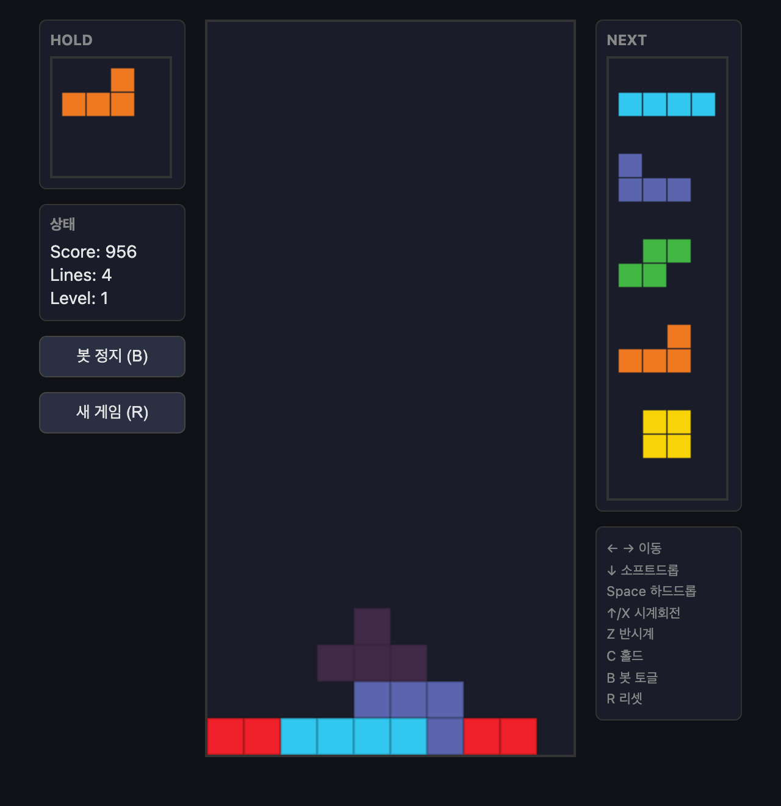

# Guideline Tetris + Bot + Benchmark

표준 테트리스 가이드라인 규칙을 지키는 웹 테트리스, 스스로 플레이하는 휴리스틱 봇, 그리고 시드 고정으로 완전 재현 가능한 성능 벤치마크.

프로젝트 코드는 모두 [`tetris/`](tetris/) 아래에 있으며, 외부 의존성·빌드 도구 없이 순수 ES 모듈로 동작한다(Node 18+).



> **B**를 누르면 봇이 스스로 플레이한다. 위 화면은 봇이 hold(왼쪽 L조각)를 활용하며 보드를 낮게 유지하는 모습이다.

## 실행

아래 명령은 모두 저장소 루트에서 실행한다.

### 웹앱
ES 모듈은 `file://`에서 로드되지 않으므로 로컬 서버가 필요하다.
```
cd tetris
python3 -m http.server 8000
# 브라우저에서 http://localhost:8000/web/
```
조작: ← → 이동, ↓ 소프트드롭, Space 하드드롭, ↑/X 시계회전, Z 반시계, C 홀드, **B 봇 토글**, R 리셋.

### 봇 벤치마크 (재현 가능)
```
node tetris/bench/bench.js --games 100 --seed 42 --maxPieces 5000 --json result.json
```
같은 `--seed`와 인자는 항상 같은 결과를 낸다. 출력은 라인/점수/조각수의 평균·중앙값·표준편차·최소·최대와 게임오버 사유 분포.

### 테스트
```
cd tetris && node --test
```

## 구현한 가이드라인 규칙
- **SRS 회전** — 4회전 상태 + JLSTZ/I 월킥 오프셋 테이블.
- **7-bag** 랜덤, **Hold**(조각당 1회), **Next 5개**, **Ghost**, **Lock delay**(0.5s·최대 15리셋).
- **T-스핀** 판정(full/mini)과 보너스 점수.
- **점수** — 라인 클리어, 소프트/하드 드롭, 콤보, Back-to-Back. 콤보와 B2B는 동시에 적용된다(레벨1 2연속 테트리스 = 1250).

## 봇
현재 조각(및 hold 조각/빈 hold 시 다음 조각)의 모든 회전×가로위치를 하드드롭 시뮬레이션해, 집계 높이·구멍·범프·완성 라인 가중합으로 최선의 착수를 고르는 휴리스틱 봇.

성능(시드 42, 30판, `--maxPieces 1000` 기준): **평균 398.6 라인 / 게임오버 0회**. 같은 인자는 항상 바이트 동일한 결과를 낸다.

## 구조
- `tetris/src/core/` — DOM/시간/전역랜덤 비의존 순수 로직(브라우저·Node 공용): `rng` · `pieces`(SRS) · `board` · `scoring` · `engine` · `bot`.
- `tetris/web/` — Canvas UI(렌더·입력·봇 자동플레이).
- `tetris/bench/` — 헤드리스 벤치마크 CLI.
- `tetris/test/` — `node:test` 유닛 테스트.
- `docs/` — 설계·구현 문서.

## 봇 튜닝
`tetris/src/core/bot.js`의 `WEIGHTS` 상수를 바꾸면 봇 성향이 바뀐다. 변경 후 `node tetris/bench/bench.js`로 재측정해 비교한다.
